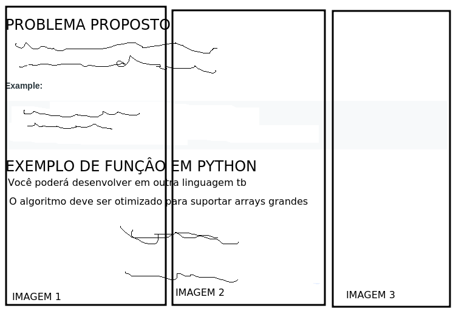
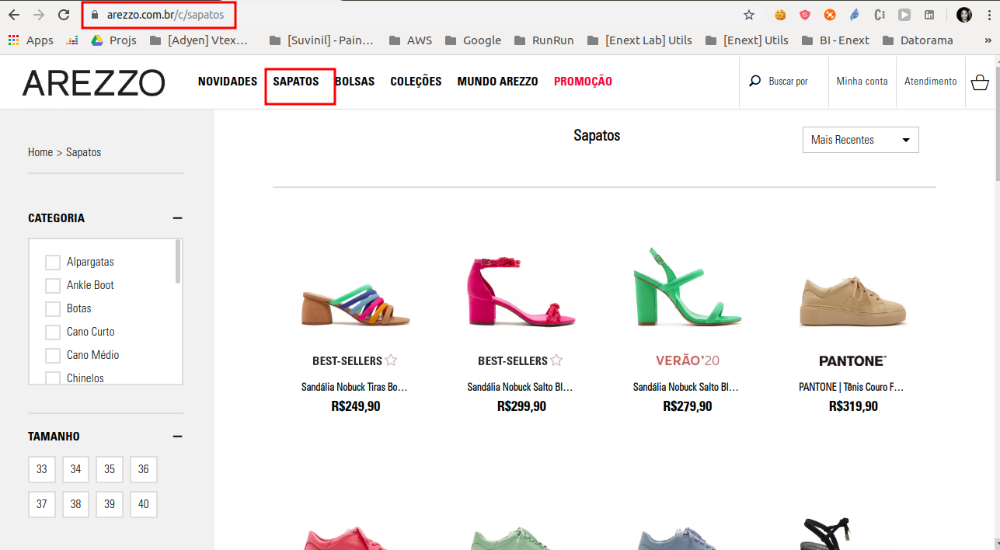
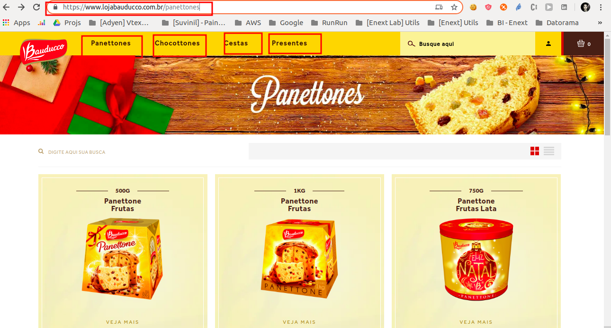
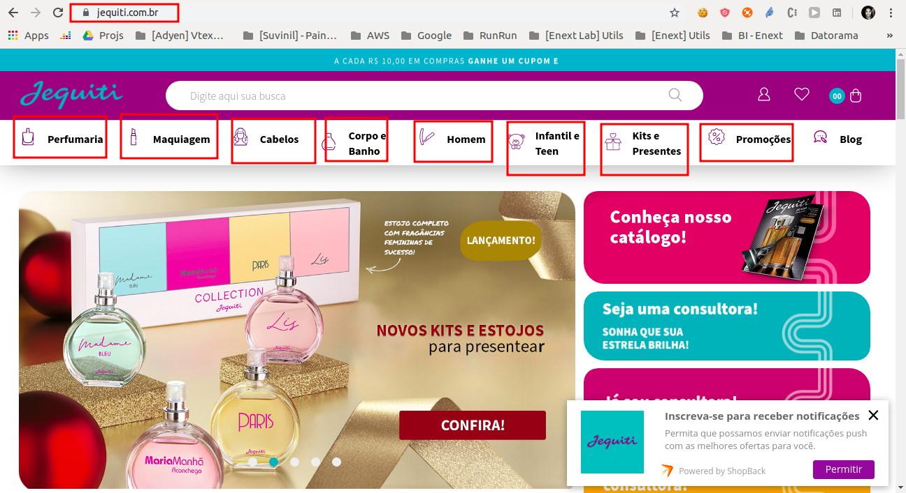

# enext-labs-university-challenge-2019

Seja bem vindo ao desafio do Enext Labs!

Nesse desafio você terá que obter as urls de produtos de alguns clientes Enext e com essas urls tentar decriptar 3 imagens. Essas três imagens, em conjunto, formam uma imagem que descreve um desafio de algoritmos (aqueles que você encontra em sites como URI Online Judge, Leet Code, olímpiadas de computação etc). O seu objetivo nesse desafio é encontrar as urls certas de produto, decriptar as imagens e resolver o desafio que essas imagens, em conjunto, formam.

Exemplo das 3 imagens que, em conjunto, formam o problema de algoritmo:

Na pasta encoded_and_encrypted_images você encontra 9 arquivos .txt contendo as imagens png encodadades em base64 e encriptadas com AES 256. Para saber mais detalhes de como essas imagens foram encriptadas e como validar se uma url consegue decriptar a imagem, recomendamos fortemente que você leia o conteúdo de um outro teste nosso. Lá explicamos tudo em detalhes:

[https://github.com/marcoprado17/enext-labs-test-products-webcrawler-v1](https://github.com/marcoprado17/enext-labs-test-products-webcrawler-v1)

## Arezzo

Na pasta arezzo, temos 3 arquivos .txt representando a primeira imagem do desafio. Cada um desses arquivos foi encriptado com uma url da seção de sapatos de arezzo (https://www.arezzo.com.br/c/sapatos)[https://www.arezzo.com.br/c/sapatos]. os 3 arquivos representam a mesmo imagem, mas foram encriptados com urls diferentes para garantir que você consiga decriptar a imagem em caso um dos produtos chave escolhidos fosse removido da loja.

Exemplo de urls candidatas:

* "https://www.arezzo.com.br/sapatos/sandalias/sandalia-nobuck-salto-bloco-tiras-verde/p/1038701220004U"
* "https://www.arezzo.com.br/sapatos/sandalias/sandalia-camila-nobuck-no-salto-bloco-amarracao-preta/p/1005503800001U"

Na verdade, as imagens são encriptadas com hash md5 da url. Mais detalhes podem ser vistos em [https://github.com/marcoprado17/enext-labs-test-products-webcrawler-v1](https://github.com/marcoprado17/enext-labs-test-products-webcrawler-v1)

As urls candidatas a chave estarão em qualquer uma das páginas da seção de sapatos:

Você só precisa encontrar uma única url chave das três possíveis.

# Bauducco

Nessa pasta, temos 3 arquivos .txt representando a segunda imagem do desafio.

Exemplo de url candidata:

* "https://www.lojabauducco.com.br/panettone-frutas-500g-caixa12--59-/p"

As urls candidatas estarão em qualquer uma das seções do site:

Você só precisa encontrar uma única url chave das três possíveis.

# Jequiti

Nessa pasta, temos 3 arquivos .txt representando a terceira imagem do desafio.

Exemplo de url candidata:

* "https://www.jequiti.com.br/shampoo-fyo-profissional-protecao-e-recuperacao-praia-e-piscina-300-ml-11662/p"

As urls candidatas estarão em qualquer uma das seções do site:

Você só precisa encontrar uma única url chave das três possíveis.

# Observações

* Ao finalizar o desafio você deverá enviar todos os arquivos pertinentes para os seguintes emails com o assunto "Enext Labs - Desafio ITA"
    * marco.vidoca@enext.com.br
    * gabriel.jacob@enext.com.br
* Você deverá enviar um zip contendo todo código desenvolvido para obter as urls de produtos e valida-las, imagem decriptadas, código solução do desafio de algoritmo proposto etc
* Você deverá criar um README.md explicando os arquivos enviadods no .zip, como você abordou o problema, tecnologias utilizadas, setup etc
* Qualquer dúvida em relação ao desafio q vc não encontre descrito nesse repositório ou em [https://github.com/marcoprado17/enext-labs-test-products-webcrawler-v1](https://github.com/marcoprado17/enext-labs-test-products-webcrawler-v1) você poderá sana-lás com:
    * Marco Aurélio Prado
    * marco.vidoca@enext.com.br
    * (11) 98140-5682
